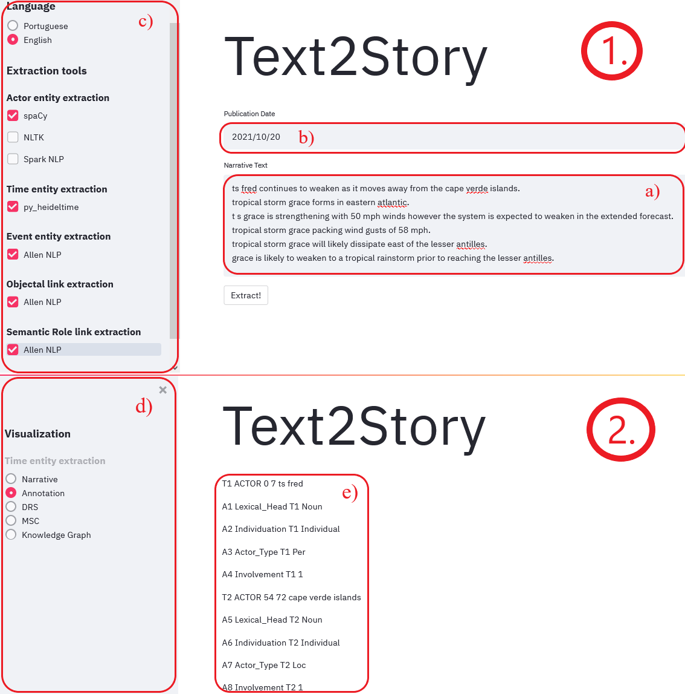

# Tweet2Story web app demo
This repository contains a demo web app that showcases the [Tweet2Story framework](https://github.com/LIAAD/Tweet2Story). If you want more information about how the Tweet2Story framework performs the narrative extraction, please take look into the previous link.

The Tweet2Story web app allows the user to introduce a set of tweets about an event (or any small text) and select which tools (Spacy, AllenNLP, etc.) they want to perform each task of the narrative extraction. The framework is modular, scalable and easy-to-use. Simply follow the [usage](#usage) instructions to get started

## Usage

#### Create a virtual environment

You will need to install [**conda**](https://conda.io/projects/conda/en/latest/user-guide/install/index.html) on your machine in order to proceed.

```shell
conda env create -f env.yml
conda activate t2s
pip install -r requirements.txt
```

#### Web app

Run this commands after creating the virtual environment

```shell
cd webapp
python backend.py
streamlit run main.py
```

and a page on your browser will open! The `python backend.py` command takes some time (2~3 minutes) to download and configure the models used in the framework. When it is done you will see the message *"Finished configuring"*.



On page 1., you can enter your tweets **separated by a new line**. If you want, you can use the example tweets on the *example_tweets* folder of the repository. Place your tweets on box a) and choose their publication date on b). Finally, you can choose the language of the tweets (currently supports Portuguese and English) and you can choose the extraction tools for each task of the narrative extraction on panel c).

When you press the *Extract!* button, the web app will take you to the second panel (2.), after a computation time of ~15 seconds. On this page, you can choose how you want to visualize the extracted narrative on panel d). Currently, you can only see the annotations, however we are planning to implement the features in the other buttons in the future. The end product of the Tweet2Story framework is shown on panel e).

### Known Bug

There is no "back" button at this moment, so if you want to make another extraction with different tweets, you will need to reload the page and it will take you to the first panel (1.) again.

## Structure

The main package is called "Text2Story", because that is the name of the [main project](https://text2story.inesctec.pt/) behind this web app. However, the entire backend of this app contains the logic and implementation of the Tweet2Story framework.

```
.
│   README.md
|   env.yml
|
└──Text2Story
      └──core
      │   │   annotator.py (META-annotator)
      │   │   entity_structures.py (ActorEntity, TimexEntity and EventEntity classes)
      │   |   exceptions.py (Exceptions raised by the package)
      │   |   link_structures.py (TemporalLink, AspectualLink, SubordinationLink, SemanticRoleLink and ObjectalLink classes)
      │   |   narrative.py (Narrative class)
      │   |   utils.py (Utility functions)
      │   
      └───annotators (tools supported by the package to do the extractions)
      |   |   NLTK
      |   │   PY_HEIDELTIME
      |   |   SPACY
      |   |   SPARKNLP
      |	  |   ALLENNLP
|
└── Webapp
      |  backend.py
      |  main.py
      |  session_state.py
      |  input_phase.py
      |  output_phase.py
|
└── example_tweets
      |  Grace-Storm-Tweets.txt
      |  Lydia-Ko-Golf.txt
```

### Annotators
All annotators have the same interface: they implement a function called 'extract_' followed by the name of the particular extraction.
E.g., if they are extracting actors, then they implement a function named 'extract_actors', with two arguments: the language of text and the text itself.

|  Extractions |           Interface                                      |     Supporting tools  |
|      ---     |             ---                                          |           ---         |
|     Actor    | extract_actors(lang, text)                               | SPACY, SPARKNLP, NLTK |
|    Timexs    | extract_timexs(lang, text, publication_time)             |      PY_HEIDELTIME    |
| ObjectalLink | extract_objectal_links(lang, text, publication_time)     |        ALLENNLP       |
|     Event    | extract_events(lang, text, publication_time)             |        ALLENNLP       |
| SemanticLink | extract_semantic_role_link(lang, text, publication_time) |        ALLENNLP       |

To **change some model used in the supported tools**, just go to text2story/annotators/ANNOTATOR_TO_BE_CHANGED and change the model in the file: \_\_init\_\_.py.

To **add a new tool**, add a folder to text2story/annotators with the name of the annotator all capitalized (just a convention; useful to avoid name colisions).
In that folder, create a file called '\_\_init\_\_.py' and there implement a function load() and the desired extraction functions.
The function load() should load the pipeline to some variable defined by you, so that, every time we do an extraction, we don't need to load the pipeline all over again. (Implement it, even if your annotator doesn't load anything. Leave it with an empty body.)

In the text2story.annotators.\_\_init\_\_.py file, add a call to the load() function, and to the extract functions.
(See the already implemented tools for guidance.)

And it should be done.

PS: Don't forget to normalize the labels to our semantic framework!

### Usage of the modules
The code below showcases how the modules are stacked in order to fully extract a narrative. 

```python
import text2story as t2s # Import the package

t2s.start() # Load the pipelines

text = 'On Friday morning, Max Healthcare, which runs 10 private hospitals around Delhi, put out an "SOS" message, saying it had less than an hour\'s supply remaining at two of its sites. The shortage was later resolved.'

doc = t2s.Narrative('en', text, '2020-05-30')

doc.extract_actors() # Extraction done with all tools.
doc.extract_actors('spacy', 'nltk') # Extraction done with the SPACY and NLTK tools.
doc.extract_actors('sparknlp') # Extraction done with just the SPARKNLP tool.

doc.extract_timexs() # Extraction done with all tools (same as specifying 'py_heideltime', since we have just one tool to extract timexs)

doc.extract_objectal_links() # Extraction of objectal links from the text with all tools (needs to be done after extracting actors, since it requires actors to make the co-reference resolution)

doc.extract_events() # Extraction of events with all tools
doc.extract_semantic_role_link() # Extraction of semantic role links with all tools (should be done after extracting events since most semantic relations are between an actor and an event)

doc.ISO_annotation('annotations.ann') # Outputs ISO annotation in .ann format (txt) in a file called 'annotations.ann'
```
